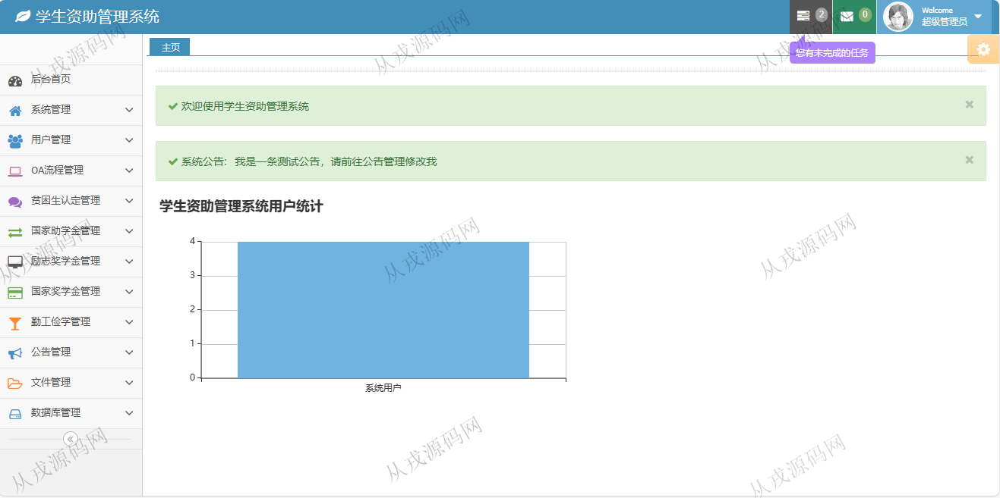
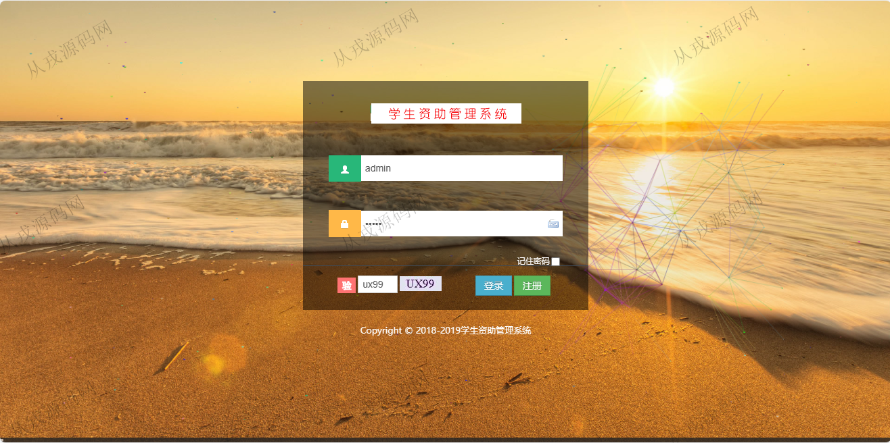
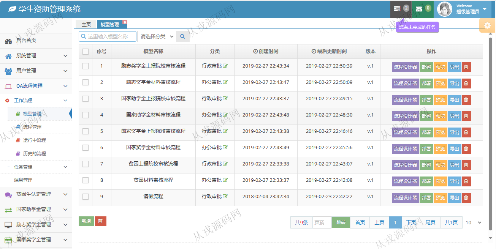
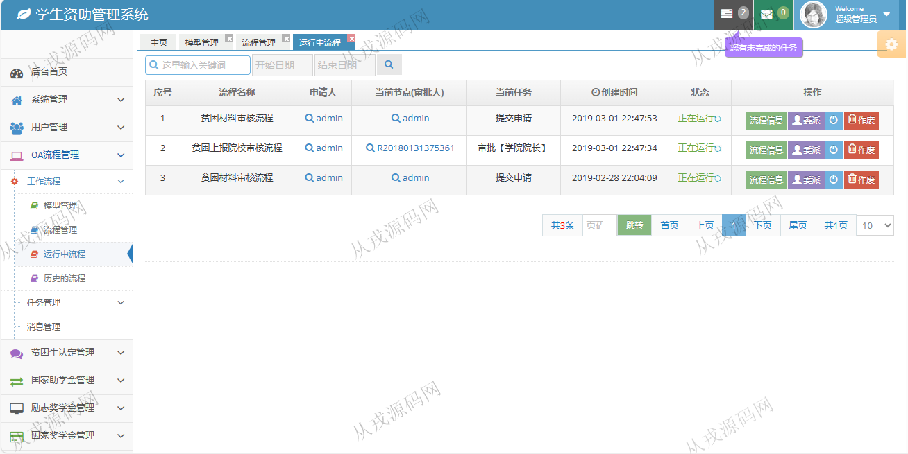
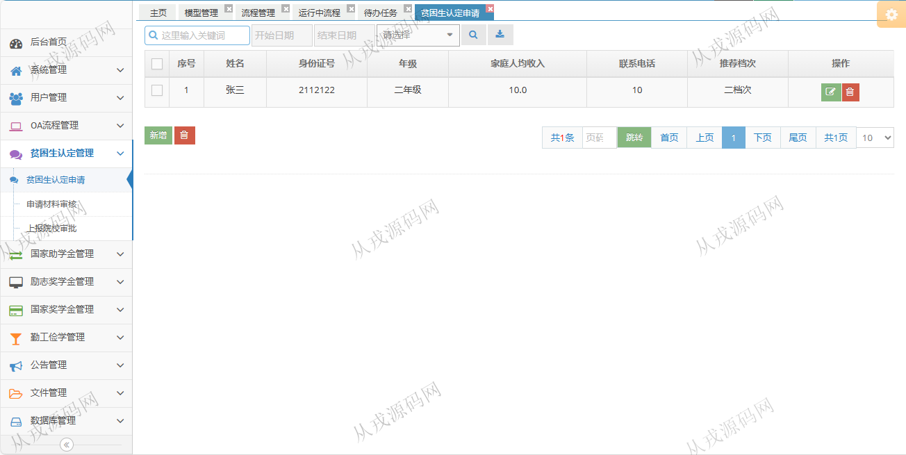
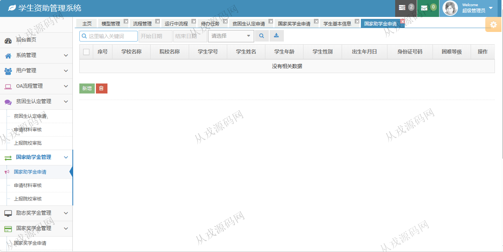
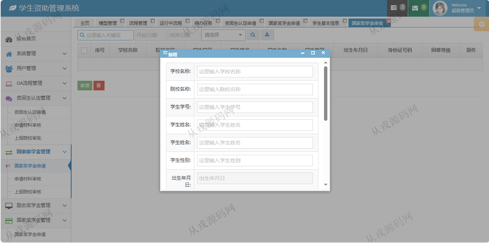
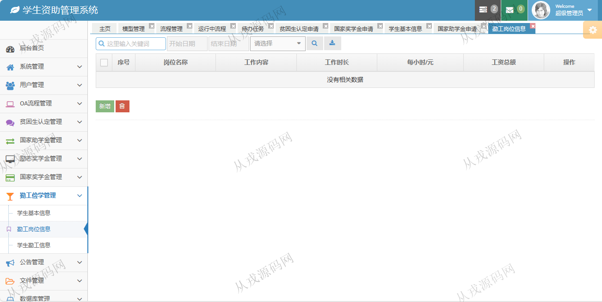
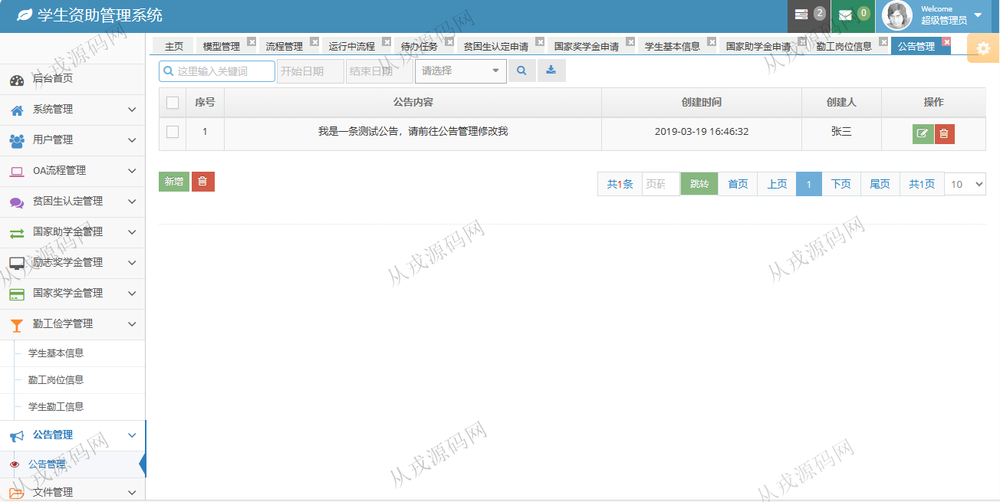

<h1 align="center">147.学生资助管理系统</h1>

- <b>完整代码获取地址：从戎源码网 ([https://armycodes.com/](https://armycodes.com/))</b>
- <b>技术探讨、资料分享，请加QQ群：692619798</b> 
- <b>作者微信：19941326836  QQ：952045282</b> 
- <b>承接计算机毕业设计、Java毕业设计、Python毕业设计、深度学习、机器学习</b>
- <b>选题+开题报告+任务书+程序定制+安装调试+论文+答辩ppt 一条龙服务</b>
- <b>所有选题地址 ([https://github.com/YuLin-Coder/AllProjectCatalog](https://github.com/YuLin-Coder/AllProjectCatalog)) </b>

## 项目介绍
基于ssm的学生资助管理系统：前端 jsp、jquery，后端 springmvc、spring、mybatis；角色分为：管理员、学生；集成OA流程管理、贫困生认定、奖学金管理等功能于一体的系统。

## 功能介绍

- 系统管理：权限管理，菜单管理，在线管理，日志管理，系统用户管理
- OA流程管理：工作流程（模型管理，流程管理，运行中流程，历史的流程），任务管理，消息管理
- 贫困生认定管理：贫困生认定申请，申请材料审核，上报院校审批
- 国家助学金管理：国家助学金申请，申请材料审核，上报院校审批
- 勤工俭学管理：学生基本信息，勤工岗位信息，学生勤工信息
- 公告管理：公告信息的增删改查

## 环境

- <b>IntelliJ IDEA 2021.3</b>

- <b>Mysql 5.7.26</b>

- <b>Tomcat 7.0.73</b>

- <b>JDK 1.8</b>

## 运行截图

